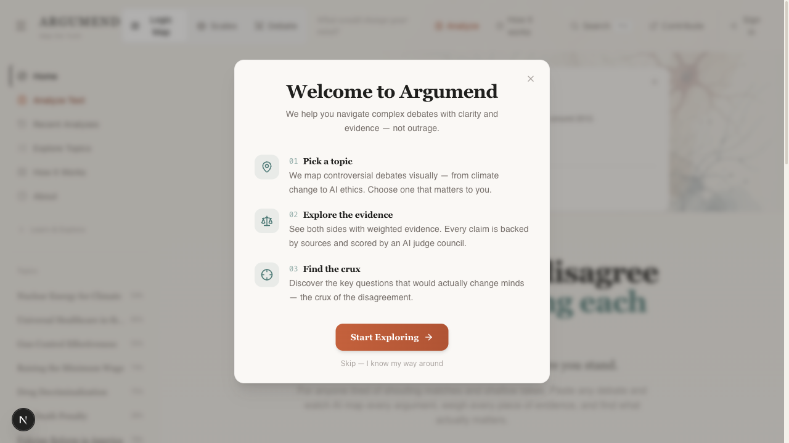
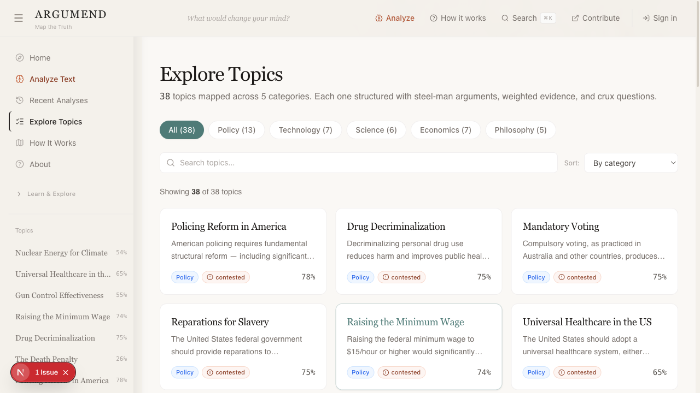
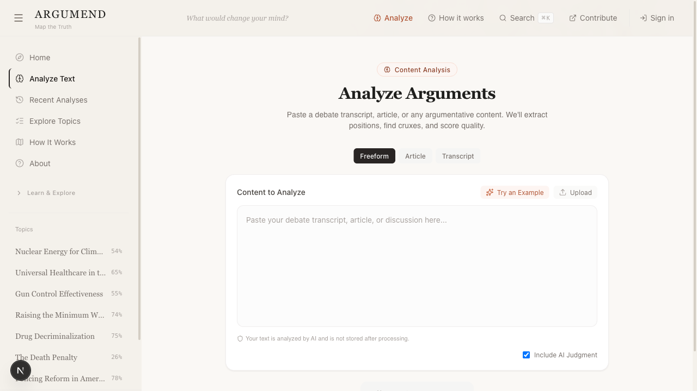

# Argumend

AI-powered argument mapping for contentious topics.

Argumend turns public questions into structured maps of positions, evidence, cruxes, confidence, and disagreement. The goal is not to make everyone agree. The goal is to make the disagreement legible enough that people can reason about it.

**Live site:** https://argumend.org

## Screenshots







## What It Does

- Maps controversial topics into interactive argument graphs
- Shows positions, evidence, cruxes, fallacies, and confidence signals
- Runs offline by default with static/programmatic topic data
- Optionally enables live AI extraction, debate generation, and judging
- Uses saved topic data so core flows can be developed without paid API calls
- Keeps the topic and blog indexes crawlable and lightweight with stable `?page=` URLs; topic category/filter query state is preserved across pages

## Tech Stack

- Next.js 16 App Router
- React 19 + TypeScript
- Bun for local development
- Tailwind CSS + Framer Motion
- React Flow for graph visualization
- Drizzle ORM + PostgreSQL
- NextAuth v5 beta
- Anthropic, OpenAI, and Google Generative AI SDKs
- Vitest + Testing Library

## Quick Start

Use Node.js 20.9 or newer and Bun 1.3.14. The repository, CI, and Docker
builder pin that Bun version so frozen-lockfile installs use the same toolchain.

```bash
bun install
bun dev
```

Open http://localhost:3000.

No API keys or database are required for the default offline mode.
The optional `.env.example` is safe to copy as-is: every external service is
blank and every live-mode flag is disabled.

## Runtime Modes

Argumend defaults to offline/programmatic generation and judging so the product can be developed and demoed without live model calls.

In offline mode, `/api/analyze`, `/api/judge`, `/api/debate`, and `/api/debate/stream` return deterministic/programmatic results without requiring auth, model API keys, or `DATABASE_URL`. If database persistence is unavailable, those endpoints still return the computed result and skip saving.

Database-backed sessions and debate persistence are enabled only when a
non-empty `DATABASE_URL` is explicitly configured. Without it, authentication
uses a degraded JWT mode and the browsing, analysis, and programmatic debate
flows remain available without attempting to initialize a database connection.
Persisted debates are private to the authenticated user who created them.
The judging API accepts evaluations via `POST`; it does not expose a global
recent-judgments collection, because verdict reasoning may derive from private
debate content.
After configuring the database, Google OAuth credentials, and `AUTH_SECRET`,
set `NEXT_PUBLIC_ENABLE_AUTH=true` to expose sign-in, the account dashboard,
and topic-follow controls. With the flag off, bookmarks remain device-local at
`/saved`; account-only navigation and follow controls are hidden, and direct
dashboard visits return to the local saved-topics view.

Enable live model-backed flows with environment flags:

```bash
ENABLE_LIVE_ANALYZE_API=true
NEXT_PUBLIC_ENABLE_LIVE_ANALYZE_API=true

ENABLE_LIVE_JUDGING_API=true
NEXT_PUBLIC_ENABLE_LIVE_JUDGING_API=true

ENABLE_LIVE_DEBATE_API=true
NEXT_PUBLIC_ENABLE_LIVE_DEBATE_API=true

ENABLE_DISAGREEMENT_V2=true
NEXT_PUBLIC_ENABLE_DISAGREEMENT_V2=true
ARGUMEND_DISAGREEMENT_MODEL=claude-sonnet-4-20250514
```

Disagreement Diagnosis V2 is a separate, source-only Analyze loop at `/analyze-v2`.
It stays off unless both flags are true and `ARGUMEND_DISAGREEMENT_MODEL` is set.
Publishing unlisted `/d/<slug>` reports also requires `ENABLE_DISAGREEMENT_PUBLISHING`,
`REPORT_PUBLICATION_SECRET`, and `DATABASE_URL`. The old `/analyze` path is unchanged.

The unprefixed `ENABLE_LIVE_*` flags are the server-side authorization boundary
for provider calls. Their matching `NEXT_PUBLIC_ENABLE_LIVE_*` flags only expose
the corresponding mode in the browser UI and never authorize backend live work
on their own; enable both halves together for a live user-facing flow.
Because Next.js embeds `NEXT_PUBLIC_*` values in client assets, set those values
at build time. The unprefixed server flags and all credentials remain runtime
environment variables and must not be passed as Docker build arguments.

Configure at least one matching provider key from `.env.example` before
enabling a live flow. Google accepts `GOOGLE_AI_API_KEY` or `GEMINI_API_KEY`;
xAI accepts `XAI_API_KEY` or `GROK_API_KEY`.

Debate responses include a typed execution envelope that distinguishes the
requested mode/model from what actually generated each turn. If authentication
or a live provider is unavailable, the API returns a programmatic result marked
with a stable fallback code; provider error details are logged server-side and
are not exposed to clients.

Google Analytics is disabled by default, including in local development and
preview deployments. Enable it explicitly by setting a measurement ID:

```bash
NEXT_PUBLIC_GA_MEASUREMENT_ID=G-XXXXXXXXXX
```

Canonical interactive map links use the root canvas route:

```text
/?topic=<topic-id>&view=logic-map
```

Three flagship ArgumentGraph debate maps use canonical `/topics/<argument-id>`
URLs. Their core reading experience is server-rendered, works offline without
API keys or a database, and presents four positions, three-to-five crux
questions, evidence, and resolution conditions through native progressive
disclosure. These debate maps are deliberately distinct from the legacy
interactive canvas topics, whose canonical links continue to use the root
`?topic=...&view=logic-map` route above.

Legacy topic graph links such as `/topics/<topic-id>?view=graph` redirect to that canvas URL.

Known public dynamic routes are validated in `proxy.ts` against lightweight
content indexes before App Router rendering begins. Invalid topic, blog, guide,
concept, fallacy, question, claim, worksheet, embed, and malformed analysis
URLs keep their public URL and query string but return a non-streamed,
crawl-safe 404 with a named page
landmark. This early boundary is intentional: a `notFound()` discovered after
React streaming starts can leave non-JavaScript clients without fallback
markup, and a segment `loading.tsx` can commit HTTP 200 before the missing-data
decision. Valid content and valid-format database-backed analysis IDs pass
through normally.

## Commands

```bash
bun dev              # local dev server
bun run build        # production build
bun run lint         # ESLint
bun run typecheck    # TypeScript without emitting files
bun run test         # Vitest, one complete run
bun run test:watch   # Vitest watch mode
bun run test:coverage
bun run check:sources # validate and probe shipped evidence citations
bun run db:generate  # generate Drizzle migrations
bun run db:migrate   # apply committed, reviewed migrations
bun run db:push      # local prototyping only; do not use for deployments
bun run db:studio    # open Drizzle Studio
```

## Production Runtime

Production builds use Bun, while the deployed Next.js standalone server runs
on Node.js 20. The split is intentional: local, Docker, and Nixpacks builds use
the Bun lockfile, and Node provides the production RSC streaming runtime. The
repository's `.node-version`, `package.json` engine, Docker image, and Nixpacks
configuration all target Node 20.

Docker is the preferred Coolify deployment path because it runs as the
unprivileged `nextjs` user and includes a container healthcheck:

```bash
docker build -t argumend .
docker run --rm -p 3000:3000 argumend
```

For a client-visible feature, pass only its public build flag, for example
`docker build --build-arg NEXT_PUBLIC_ENABLE_AUTH=true -t argumend .`, then
provide `DATABASE_URL`, `AUTH_SECRET`, and provider credentials only to
`docker run` or the deployment runtime.

Add `--env-file .env` only when enabling optional persistence, authentication,
analytics, or live model providers.

Configure Coolify's health path as `/api/health`. The probe verifies that the
server is running and the static topic corpus is available; it deliberately
does not contact optional databases or model providers, so the default offline
product remains ready without credentials. The endpoint is dynamic and
non-cacheable.

`nixpacks.toml` remains supported when Dockerfile deployments are unavailable.
It performs `bun run build`, then uses `exec node` so termination signals reach
the standalone server. Coolify supplies `PORT`; both deployment paths bind to
`0.0.0.0`. Neither path runs database migrations automatically—apply reviewed
migrations as a separate, explicit release operation when persistence is
enabled.

After any production build, verify the assembled standalone directory locally:

```bash
bun run smoke:standalone
```

That smoke check starts the packaged server with every optional integration
disabled; verifies health, the homepage, public and Next static assets, API v1,
offline analysis, programmatic debate, and offline judging without persistence;
then sends `SIGTERM` and requires the process to stop promptly.

## Database Migrations

Production and shared environments should be updated with committed migrations,
not `db:push`:

1. Change `lib/db/schema.ts`.
2. Run `bun run db:generate -- --name <descriptive-name>` locally.
3. Review the generated SQL and snapshot under `drizzle/`.
4. Back up the target database, configure its `DATABASE_URL`, and run
   `bun run db:migrate` once during deployment.

Migration `0001_privacy_auth_schema` creates the Auth.js, newsletter, saved-topic,
topic-view, and topic-subscription tables; adds analysis/debate ownership and
current indexes; and adds the newer derived analysis fields. It also intentionally
drops the historical `analyses.content_hash` and `analyses.input_content` columns
as a privacy cleanup. That data removal is irreversible, so back up any existing
database before applying the migration.

## Project Structure

```text
app/                    Next.js routes, pages, API endpoints
components/             Product UI, graph views, topic cards, shell
components/nodes/       React Flow node components
data/                   Static topics, guides, blog content, mock debates
hooks/                  Client state and graph orchestration
lib/analyze/            Argument extraction and offline analysis
lib/debate/             Debate generation and persistence
lib/judge/              Multi-model judging
lib/db/                 Drizzle schema and database helpers
types/                  Shared TypeScript types
```

## Development Notes

- Use offline mode unless a task specifically needs live model behavior.
- Keep topic data deterministic so graph behavior is easy to test.
- Prefer typed schemas at boundaries; do not let raw model output flow directly into UI state.
- Run `bun run test` and `bun run lint` before opening a PR. (`bun test`
  invokes Bun's separate native runner and does not load this project's Vitest
  configuration.)

## License

[ISC](LICENSE)
